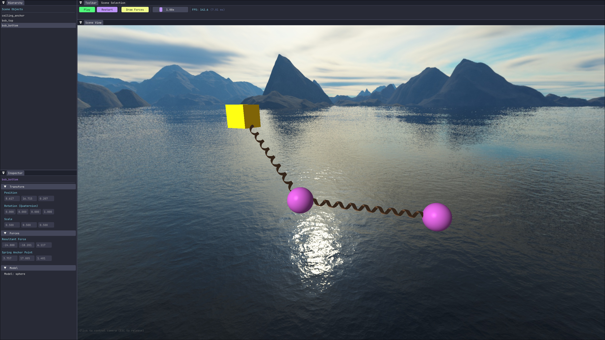
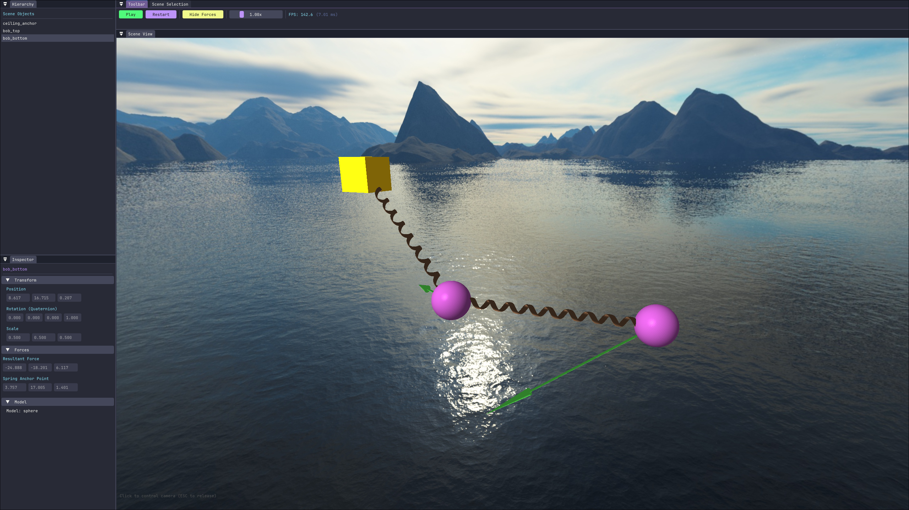
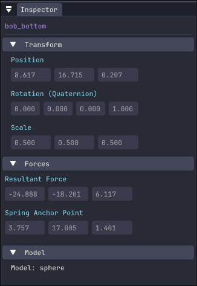
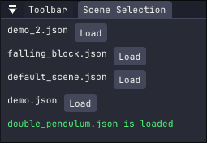
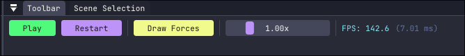

# Vectra

## Introduction
Vectra is a modern, extensible rigid-body physics engine (and graphical engine) written in C++ built from the ground up. Designed for flexibility and ease of use, it enables simulation of a wide range of physical phenomena, from simple object interactions to complex systems. With a clean architecture and multithreaded design, Vectra is ideal for both real-time applications and academic exploration. 

---


*Double pendulum demo showing live forces*

---

## Features

### Physics Simulation
- **Rigid Body Dynamics**: Simulate linear and angular motion with realistic mass and inertia properties.
- **Force Accumulation**: Apply forces at arbitrary points with automatic torque calculation.
- **Collision Detection**: Efficient broad-phase culling and precise narrow-phase detection.
- **Impulse-Based Response**: Handle collisions with restitution and friction (friction is being implemented).

### Scene Management
- **JSON-Based Serialization**: Save and load scenes with a human-readable format.
- **Smart Defaults**: Minimal configuration required for quick prototyping.
- **Error Handling**: Comprehensive validation for scene files.

### Rendering
- **Modern OpenGL**: Core profile rendering pipeline with dynamic lighting and skyboxes.
- **Model Loading**: Import 3D assets in various formats (OBJ, FBX, GLTF).
- **Customizable Shaders**: Modular GLSL shaders for diverse visual effects.

### Extensibility
- **Custom Forces**: Easily implement new force generators for unique simulations.
- **Component-Based Design**: Extend objects with modular components.
- **Multithreaded Architecture**: Decoupled physics and rendering for optimal performance.

---
## Technical Architecture

### Physics Pipeline & Collision Logic

- **Broad Phase**: A Dynamic Bounding Volume Hierarchy (BVH) is used to handle moving bodies efficiently. The engine implements AABB Refitting, avoiding a full tree rebuild every tick while maintaining $O(n \log n)$ query performance. This allows for efficient collision detection even in scenes with many dynamic objects.
- **Narrow Phase**: Implements SAT (Separating Axis Theorem) for collision detection between boxes. Optimized intersection tests for Sphere-Sphere and Sphere-Box to minimize computational overhead.
- **Contact Resolution**: An impulse-based approach is used to resolve collisions, applying impulses to separate objects and prevent interpenetration. Restitution and momentum are incorporated for realistic interactions.

### Multithreaded Model


Vectra uses a **Producer-Consumer** model to decouple simulation logic from the rendering loop:

* **Fixed-Step Physics (Producer):** Runs on a dedicated thread using a **fixed time-step accumulator**. This ensures deterministic behavior and prevents the "Spiral of Death" by clamping physics updates if the simulation falls behind real-time.
* **Synchronized Snapshot Queue (Consumer):** The main thread pops thread-safe **Scene Snapshots** from a bounded blocking queue ($N=3$). This provides natural back-pressure, preventing the physics thread from over-allocating memory if the GPU lags.

---

### Mathematical Foundation

Vectra is built on a first principles approach to classical mechanics, ensuring high-fidelity motion for non-spherical bodies.

#### **1. Rotational Dynamics & Inertia Tensors**
To simulate realistic rotation, the engine accounts for mass distribution via the **Inertia Tensor ($I$)**. Unlike point masses, rigid bodies have different rotational resistance depending on the axis. To avoid the computational cost of recalculating the tensor in world space every frame, Vectra stores the **Principal Moments of Inertia** in local space and transforms them using the current orientation matrix ($R$):

$$I_{world} = R I_{local} R^T$$

This transformation allows the engine to solve for **Angular Acceleration ($\alpha$)** using the rotational analogue of Newton's Second Law:
$$\tau = I_{world} \alpha$$
Where $\tau$ represents the accumulated **Torque** from all contact impulses and external forces.


#### **2. Orientation via Quaternions**
To represent 3D rotation without the risk of **Gimbal Lock**—a common failure point in Euler-based systems—Vectra utilizes **Quaternions ($q = w + xi + yj + zk$)**.
* **Stability:** Quaternions provide a more numerically stable representation for high-speed rotations.
* **Integration:** Angular velocity ($\omega$) is integrated into the orientation using the derivative of the quaternion:
  $$\dot{q} = \frac{1}{2} \omega q$$

#### **3. Impulse-Based Constraint Resolution**
Collisions are resolved by applying a calculated **Impulse ($J$)** at the contact point. This impulse instantly changes the linear and angular velocities to satisfy the **Signorini-Fichera conditions** (non-penetration):
$$v_{new} = v_{old} + \frac{J}{M}$$
$$\omega_{new} = \omega_{old} + I_{world}^{-1} (r \times J)$$
Where $r$ is the vector from the Center of Mass to the contact point.


---

## Getting Started

### Prerequisites
- **C++ Compiler**: C++17 support (e.g., GCC 7+, Clang 5+, MSVC 2017+).
- **CMake**: Version 3.16 or higher.
- **OpenGL**: Version 3.3 or higher.
- **Git**: For cloning the repository.

### Build Instructions

#### Linux / macOS
```bash
# Clone the repository with submodules
git clone --recursive https://github.com/carlos-lorenzo/vectra.git
cd vectra

# Initialize submodules if not cloned recursively
./update_submodules.sh

# Build the project
mkdir build && cd build
cmake ..
make -j$(nproc)
```

#### Windows
```powershell
# Clone the repository with submodules
git clone --recursive https://github.com/carlos-lorenzo/vectra.git
cd vectra

# Initialize submodules if not cloned recursively
update_submodules.bat

# Build with Visual Studio
mkdir build && cd build
cmake .. -G "Visual Studio 17 2022"
cmake --build . --config Release
```

---

## Usage

### Quick Start
Load and run a default scene:
```cpp
#include "vectra/core/engine.h"

int main() {
    auto engine = std::make_unique<Engine>();
    engine->load_scene("default_scene.json");
    engine->run();
    return 0;
}
```

### Scene Example
```json
{
    "name": "Sample Scene",
    "objects": [
        {
            "name": "ground",
            "rigidbody": {
                "mass": 0,
                "transform": { "scale": [100, 1, 100] }
            }
        },
        {
            "name": "sphere",
            "rigidbody": {
                "mass": 1.0,
                "transform": { "position": [0, 10, 0] }
            }
        }
    ]
}
```

---

## Documentation
- **[Scene Schema](./docs/SCENE_SCHEMA.md)**: Detailed JSON format specification.
- **[Core Module](./src/core/README.md)**: Engine and scene management.
- **[Physics Module](./src/physics/README.md)**: Rigidbody dynamics and collision handling.
- **[Rendering Module](./src/rendering/README.md)**: Graphics pipeline and shaders.

---

## Roadmap

- **Shadow Mapping**: Real-time shadows for enhanced realism.
- **Constraint System**: Joints, hinges, and rigid connections.
- **Friction Model**: Static and dynamic friction handling.

---

## License
This project is licensed under the MIT License. See the [LICENSE](./LICENSE) file for details.

---

## Screenshots

### Editor Interface


*The Unity/Godot-inspired editor with dockable panels.*

### Forces Visualization


*Real-time visualization of forces acting on objects.*


### Inspector Panel


*View object properties such as transforms, rigidbodies, and model.*

### Scene Loading


*Load and manage scenes with a clean and intuitive interface.*

### Toolbar


*Control simulation playback, speed, and view performance metrics.*

---


## Bibliography
- Millington, I. (2010). Game physics engine development: How to build a robust commercial-grade physics engine for your game (2nd ed.). CRC Press. https://doi.org/10.1201/b13170.
- https://learnopengl.com/
